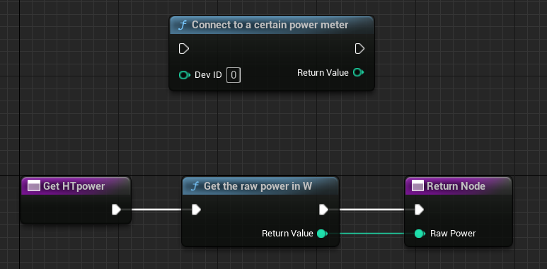


# Intro

- [x] Works with Unreal 5.1 on Windows
- [ ] Adapt CMake for Mac/ Linux targets
- [ ] Test on macOS
- [ ] Test on Linux

In the current state this library only works on Windows, and can connect to a single home trainer (FEC device) of a user-defined device ID (see ANT+ documentation).

For commercial purposes please contact me :-)

## Using in UE-5

if you don't have / know CMake, you'll need a fresh installation of it:
<https://cmake.org/download/>

- add the following text to your project's main folder .uproject file in the section Plugins:

```text
		{
			"Name": "CMakeTarget",
			"Enabled": true
		}
```

Your whole file should now look like this (mind the extra commas):

```text
{
	"FileVersion": 3,
	"EngineAssociation": "5.1",
	"Category": "",
	"Description": "",
	"Plugins": [
		{
			"Name": "CMakeTarget",
			"Enabled": true
		}
	]
}
```

- Copy the entire `Plugins/AntPlusPlugin` folder to your UE project `Plugins` folder
- Copy the entire `Plugins/UE4Cmake` folder to your UE project `Plugins` folder
- Compile your project code from your Unreal engine main project window: <https://forums.unrealengine.com/t/ue5-compile-and-live-coding-button/232894/4>

New functions are now available for your blueprints:

```c
    UFUNCTION(BlueprintCallable, meta = (DisplayName = "Connect to a certain power meter", Keywords = "AntPlusPlugin power meter connect"), Category = "AntPlusPlugin")
    static int connectPowerMeterDeviceID(int devID);

    UFUNCTION(BlueprintCallable, meta = (DisplayName = "Get the raw power in W", Keywords = "AntPlusPlugin power get"), Category = "AntPlusPlugin")
    static int getRawPower();

    UFUNCTION(BlueprintCallable, meta = (DisplayName = "Send bytes to the ANT+ channel", Keywords = "AntPlusPlugin bytes send"), Category = "AntPlusPlugin")
    static void sendBytes(int page, int byte1, int byte2, int byte3, int byte4, int byte5, int byte6, int byte7);

    UFUNCTION(BlueprintCallable, meta = (DisplayName = "Set the FEC trainer target power", Keywords = "AntPlusPlugin FEC target power"), Category = "AntPlusPlugin")
    static void setFECPage49(float targetPower);

    UFUNCTION(BlueprintCallable, meta = (DisplayName = "Set the FEC trainer target slope", Keywords = "AntPlusPlugin FEC target slope"), Category = "AntPlusPlugin")
    static void setFECPage51(float targetSlope, float targetResistance);
```

## Steps for using the plugin

### ANT+ FEC home trainer

First, set your ANT+ home trainer device ID (16 bits unsigned) using the Blueprint block in the top.

In your code you can then call the second block to read the last received power from the sensor. You can also set the trainer target power or slope using the dedicated blueprint blocks.
But DO NOT CALL THESE MORE THAN AT 2Hz !


