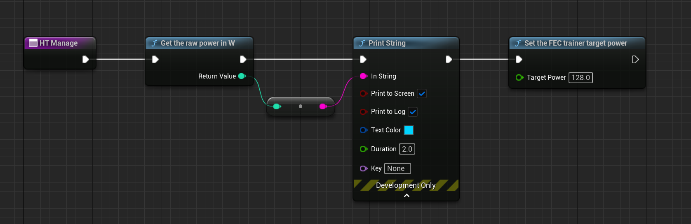

# Intro

## Purpose

This repo will help projects relying on ANT+ RF communications connect accessories to their Unreal Engine game projects.

It relies on the official ANT+ library v3.5 and a few source files breaking out a small set of features to blueprint development.
In order to compile these source files, a set of CMake files is provided, as well as the external plugin UE4CMake (https://github.com/caseymcc/UE4CMake).

In the current state this library was only tested on Windows, and can connect to a single home trainer (FEC device) of a user-defined device ID (see ANT+ documentation).

For commercial purposes please contact me :-)

## Setup

### Preparation

if you don't have / know CMake, you'll need a fresh installation of it:
<https://cmake.org/download/>

### Project setup

- add the following text to your project's main folder .uproject file in the section Plugins (described in [https://github.com/caseymcc/UE4CMake](https://github.com/caseymcc/UE4CMake#setup)):

```text
		{
			"Name": "CMakeTarget",
			"Enabled": true
		}
```

Your whole file should now look like this (mind the extra commas):

```text
{
	"FileVersion": 3,
	"EngineAssociation": "5.1",
	"Category": "",
	"Description": "",
	"Plugins": [
		{
			"Name": "CMakeTarget",
			"Enabled": true
		}
	]
}
```

- Copy the entire `Plugins/AntPlusPlugin` folder to your UE project `Plugins` folder
- Copy the entire `Plugins/UE4Cmake` folder to your UE project `Plugins` folder
- Compile your project code from your Unreal engine main project window: <https://forums.unrealengine.com/t/ue5-compile-and-live-coding-button/232894/4>

New functions are now available for your blueprints:

```c
    UFUNCTION(BlueprintCallable, meta = (DisplayName = "Connect to a certain power meter", Keywords = "AntPlusPlugin power meter connect"), Category = "AntPlusPlugin")
    static int connectPowerMeterDeviceID(int devID);

    UFUNCTION(BlueprintCallable, meta = (DisplayName = "Get the raw power in W", Keywords = "AntPlusPlugin power get"), Category = "AntPlusPlugin")
    static int getRawPower();

    UFUNCTION(BlueprintCallable, meta = (DisplayName = "Send bytes to the ANT+ channel", Keywords = "AntPlusPlugin bytes send"), Category = "AntPlusPlugin")
    static void sendBytes(int page, int byte1, int byte2, int byte3, int byte4, int byte5, int byte6, int byte7);

    UFUNCTION(BlueprintCallable, meta = (DisplayName = "Set the FEC trainer target power", Keywords = "AntPlusPlugin FEC target power"), Category = "AntPlusPlugin")
    static void setFECPage49(float targetPower);

    UFUNCTION(BlueprintCallable, meta = (DisplayName = "Set the FEC trainer target slope", Keywords = "AntPlusPlugin FEC target slope"), Category = "AntPlusPlugin")
    static void setFECPage51(float targetSlope, float targetResistance);
```

## Steps for using the plugin

### ANT+ FEC home trainer

Here is an example implementation using a controller blueprint:




First, int the BeginPlay event you'll need to call "Connect to a certain power meter" ONCE (it performs the library initialization), setting your ANT+ power meter device ID (16 bits unsigned) using the Blueprint block in the top right.
Then call the function that starts the ANT+ loop (separate thread).
You can define a timer that will call the library at regular intervals to get the data from the trainer and also set the ANT+ pages data.

In the code running from the timer you can then call "GetHTPower" to read the last received power.

To send the trainer target slope, call the corresponding bloc followed by "Update the trainer simulation".  
But DO NOT CALL "Update the trainer simulation" AT MORE THAN 2Hz !
